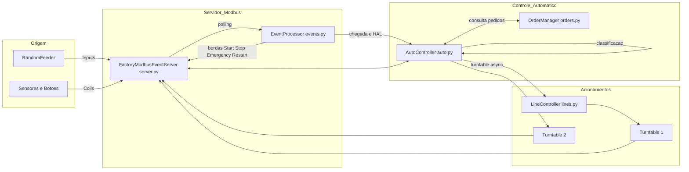

# Fluxograma Geral do Sistema

Abaixo está um fluxograma **Mermaid** que representa o caminho completo do sinal: dos sensores (ou simulador) até as decisões de automação e atuadores (esteiras/turntables).



> **Leitura do diagrama:**
>
> * **EventProcessor** lê bordas e decide **o que** sinalizar: ligar linha azul/verde/vazio, enfileirar chegada, acionar HAL ou botões.
> * **AutoController** decide **para onde** enviar a peça (estoque ou pedido) e orquestra **Turntable 1** (TT1) e **Turntable 2** (TT2).
> * **LineController** traduz decisões em **atuadores** (giro e esteiras), com **watcher** para desligar belt ao atingir limites.
> * **OrderManager** informa se há pedidos e consome caixas atendidas.
> * **Server** faz o **polling**, mantém estados globais e expõe leitura/escrita do banco Modbus.

---

# README (Resumo do Projeto)

## Visão Geral

Este projeto implementa uma **célula de automação** simulada com Modbus, turntables e esteiras, suportando **classificação HAL**, **estoque** e **atendimento de pedidos**. Inclui um **feeder aleatório** para testes sem hardware.

**Principais módulos:**

* `server.py` — Servidor Modbus + loop de eventos + estados globais
* `events.py` — Detecção de bordas e despacho de callbacks
* `auto.py` — Lógica automática (fila de chegadas, HAL, TT1/TT2)
* `lines.py` — Acionamento físico (giro, belt, watchers)
* `orders.py` — Fila de pedidos (FIFO) e consumo por cor
* `random_feeder.py` — Simulador de entradas (caixote/produto) com offsets
* `addresses.py` — Mapa de **Coils/Inputs/Esteiras**
* `utils.py` — Utilidades (`now()`, `Stoppable`)

## Arquitetura (resumo)

1. **Server** (Modbus) faz polling dos **coils** e repassa para o `EventProcessor`.
2. **EventProcessor** detecta bordas (Start/Stop/Emergency/HAL/Arrivals) e chama `AutoController` ou handlers do `Server`.
3. **AutoController** decide rotas (**ORDER** ou **NO_ORDER**) com apoio do `OrderManager`, aciona `LineController` para **TT1** e coordena **TT2**.
4. **LineController** traduz comandos em **atuadores** (`set_actuator`) e executa watchers de limite.
5. **RandomFeeder** injeta eventos (`Inputs`) simulando hardware real.

## Fluxo alto nível

* **Chegada** → `EventProcessor.enqueue_arrival(...)` → `AutoController` ativa **TT1**, move peça e executa **pós-limite** até o final da produção.
* **HAL** → `hal_sequence()` amostra `Vision_Blue/Green` → `on_hal_classified()` → **TT2** (pedido) ou **estoque**.
* **Pedidos** → `OrderManager.create_order(...)` → consumidos por `_tt2_cycle_order()`.

## Execução (exemplo minimal)

```bash
python main.py
```

* `main.py` cria `FactoryModbusEventServer`, `AutoController` e `RandomFeeder`.
* Para iniciar a automação, acione o **Start** (coil/button).
* `Ctrl+C` encerra com **stop** limpo de threads e atuadores.

> **Dica:** Ajuste `period_s` e `pulse_ms` no `RandomFeeder` para calibrar a cadência de testes.

## Operação (botões)

* **Start**: entra em `running`, habilita automação
* **Stop**: para as linhas (sem emergência)
* **Emergency (toggle)**: entra/retorna de `emergency` e desliga atuadores
* **Restart**: restabelece estados e religa atuadores
* **Create_OP**: cria pedidos (usar via `events`/lógica do operador)

## Estrutura de Pastas (sugestão)

```
.
├─ controllers/
│  ├─ auto.py
│  ├─ events.py
│  └─ lines.py
├─ simulators/
│  └─ random_feeder.py
├─ services/
│  └─ orders.py
├─ addresses.py
├─ server.py
├─ utils.py
└─ main.py

---

**Autores:** 

1. Thiago Rodrigo Monteiro Salgado
2. Lukas Lujan Moreira
3. Nathalia Damasceno Colares