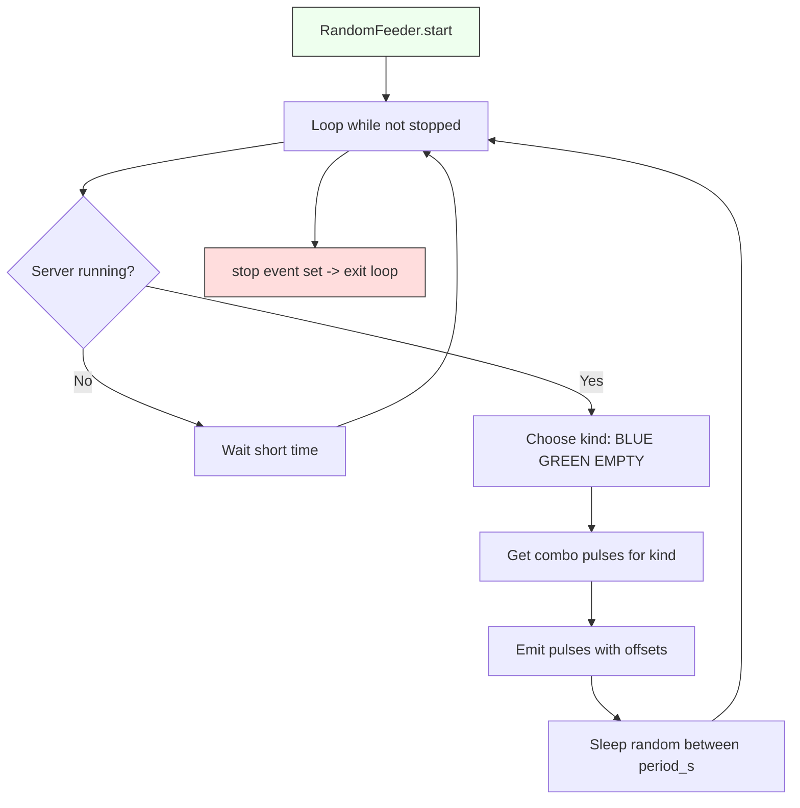

# Documentação das Funções — RandomFeeder

## Sumário
- Visão Geral
- Funcionamento Geral
- Atributos Principais
- Funções públicas e internas

Este documento descreve o funcionamento do arquivo `random_feeder.py`, explicando a lógica de cada função e da simulação, **sem modificar o código original**.

Arquivo de referência: `random_feeder.py` 

---

## Fluxograma do RandomFeeder



> Observação: o fluxograma mostra o comportamento principal do `RandomFeeder`: verifica se o servidor está em modo `running`, escolhe um tipo de peça, emite o combo de pulsos (respeitando offsets) e aguarda um intervalo aleatório antes de repetir.
# Documentação das Funções — RandomFeeder

Este documento descreve o funcionamento do arquivo `random_feeder.py`, explicando a lógica de cada função e da simulação, **sem modificar o código original**.

Arquivo de referência: `random_feeder.py` fileciteturn4file0

---

## 🧩 Visão Geral

O módulo **RandomFeeder** simula a entrada aleatória de caixas no sistema, como se fossem sensores/atuadores físicos enviando peças reais para a linha.

Ele é usado para testes automáticos do sistema **sem necessidade de operador** ou hardware real.

Funciona emitindo pulsos digitais (`set_actuator(True/False)`) nos endereços de entrada (`Inputs.*`), como se **caixotes e produtos** estivessem sendo detectados.

---

## ⚙️ Funcionamento Geral

* O feeder executa em **loop assíncrono**, rodando em thread própria
* A cada ciclo, escolhe aleatoriamente entre: `BLUE`, `GREEN` ou `EMPTY`
* Para cada escolha, emite **um combo de pulsos** representando caixote + produto (exceto vazio)
* Seu tempo de emissão é baseado em `period_s` (intervalo aleatório)
* Cada item do combo pode ter um offset (produto antes/depois do caixote)

Exemplo de emissão:

```
BLUE → ativa DI: Emmiter_Caixote_Azul + Emmiter_Product_Azul
GREEN → idem com endereços verdes
EMPTY → só caixote vazio, sem produto
```

---

## 🔍 Atributos Principais

| Atributo        | Função                                                      |
| --------------- | ----------------------------------------------------------- |
| `self.server`   | Interface para setar atuadores físicos do sistema           |
| `self.period_s` | Intervalo aleatório entre emissões `(min, max)` em segundos |
| `self.pulse_ms` | Tempo de pulso ON -> OFF em cada emissão                    |
| `self.combos`   | Mapa de peças para lista de pulsos + offsets                |
| `self._stop`    | Evento usado para interromper a thread                      |
| `self._th`      | Referência da thread do feeder                              |

---

## 📌 Funções Públicas

### `start()`

Inicia o alimentador caso ainda não esteja rodando.
Cria uma thread daemon que executa `_loop()`.

### `stop()`

Sinaliza `_stop` para finalizar o loop da thread.

---

## 🔄 Funções Internas

### `_pulse(di_addr)`

Envia **um único pulso digital** para o endereço indicado:

1. `set_actuator(addr, True)`
2. Espera `pulse_ms` ms
3. `set_actuator(addr, False)`

Simula um sensor sendo ativado e liberado.

### `_pulse_combo(items)`

Executa **vários pulsos com offsets relativos**.
Cada item de `items` tem formato:

```
(addr, offset_ms)
```

Exemplo: Produto azul pode ser disparado 40 ms antes do caixote azul.

Fluxo:

1. Calcula o menor offset (pode ser negativo)
2. Define tempo base, garantindo que itens negativos não sejam perdidos
3. Cria uma thread para cada pulso, respeitando seu offset

Exemplo visual:

```
Caixote: offset 0 ms
Produto: offset -40 ms  (dispara 40ms antes)
```

---

### `_loop()` — "coração do feeder"

Executa enquanto `_stop` **não** estiver setado:

1. Verifica se máquina está em modo `running`
2. Escolhe aleatoriamente entre BLUE / GREEN / EMPTY
3. Obtém lista de pulsos do combo
4. Aguarda espaçamento mínimo (`min_gap`)
5. Chama `_pulse_combo()` para emitir nos inputs
6. Dorme tempo aleatório dentro de `period_s`

Também suporta emissão condicionada (ex: desligar se emergência ativa).

---

## 📌 Estrutura dos Combos

Cada combo define **quais sensores devem ser pulsados** para simular uma peça.

```python
self.combos = {
    "BLUE":  [(Inputs.Emmiter_Caixote_Azul, 0), (Inputs.Emmiter_Product_Azul, 0)],
}
```

✅ Pode ser expandido: basta adicionar itens com offsets diferentes.

---