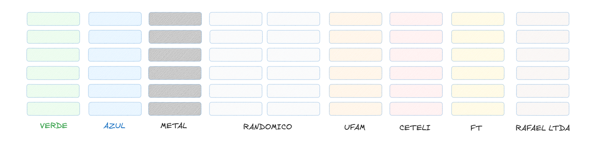

# Funcionamento dos IOs

Basicamente aqui vão ficar anotadas as descrições das IOs porque muito provavelmente eu vou esquecer alguma coisa.

# Sistemas

para facilitar, a planta foi dividida da forma que o professor comentou: basicamente existem 3 sistemas:
- Feeder
- Warehouse
- Esteiras intermediárias

### Feeder

Para o Feeder, vai acontecer o seguinte: simulada como na imagem abaixo 

- As 4 primeiras estantes são relativas a 4 empresas diferentes;
- Sobram 5 estantes de estoque, contudo, 2 são dedicadas a qualquer resto e a prioridade é encher o estoque com cada uma de forma específica, ou seja, uma totalmente verde, outra azul e uma de metal.

### warehouse
### esteiras intermediárias

# Entendendo warehouse

nunca havia utilizado warehouse no Factory/IO, mas basicamente ela vai possuir as seguintes IOs:

- **Manejador direita**: basicamente a plataforma corre um trilho com a caixa para colocar dentro da warehouse
- **Manejador Esquerda**: o mesmo do anterior, porém esse vem para o lado de fora, ou seja, seu objetivo é pegar a caixa
- **sensor do meio**: seu objetivo é detectar se há ou não caixa no meio da plataforma
- **Manejador levantar**: a plataforma fica sempre no chão e o objetivo do Z é deixá-la na altura de uma esteira, para que ela consiga pegar uma caixa
- **Posição Alvo**: indica a posição da plataforma para onde voce quer mandar o cartesiano buscar a caixa

### pontos de acesso
Podemos pegar a caixa na posição alvo 1 ou na 8, sendo que na 8 é a primeira entrada (mais proxima do feeder) e na 1 a segunda.

### funcionamento para deixar uma caixa

deve-se descer o manejador levantar para que ele deixe a caixa na posição que se deseja. Então, 
- __para pegar__: com o manejador levantar abaixado vai ate a posição alvo, levante o manejador levantar (ative-o)  e então remova a caixa 
- __para deixar__: com o manejador levantar ativado vai ate a posição alvo, desça o manejador levantar (desative-o)  e então recolha a plataforma e retorne para o home 

